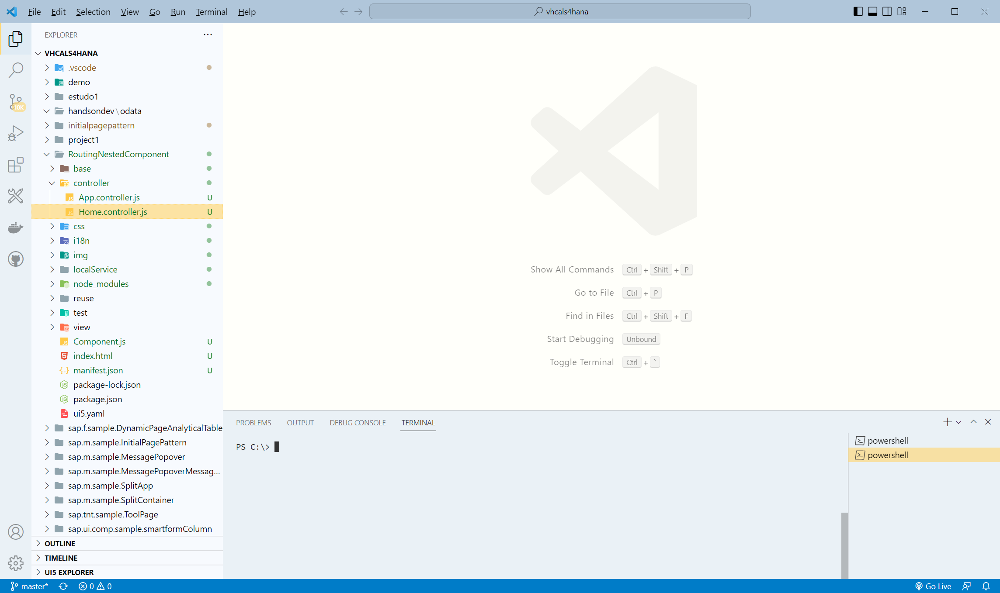
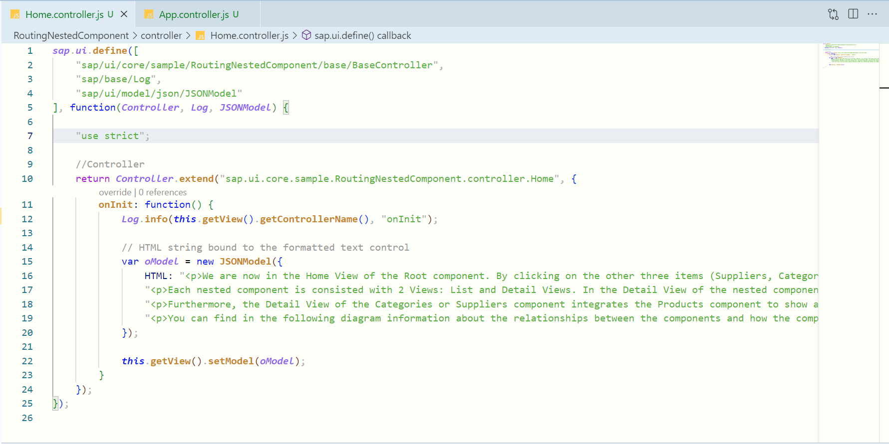
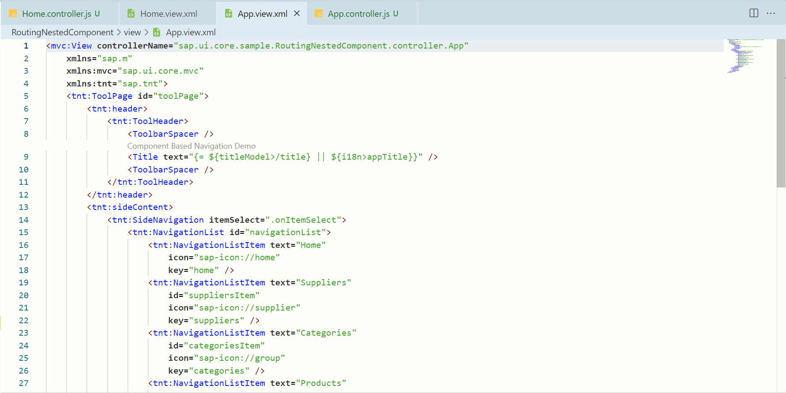
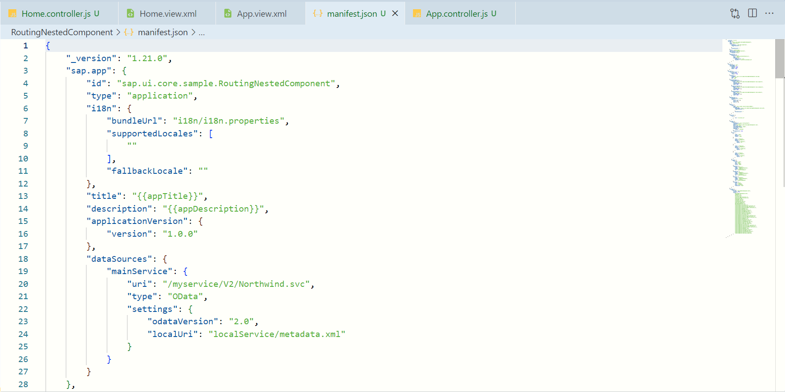

# SAP Workbench Theme README

## My very first extension

This is my first extension/theme I just created for myself, but feel free to use, change, do whatever you want.

I did want to bring my VSCode closer to my SAP Workbench and make coding a more SAP-like experience, which I really enjoy. Hope you enjoy this simplistic attempt to achieve it.

I'm using it to write my codes in Javascript, UI5, Fiori, XML, HTML, CSS trying to use a color pallete that don't cause too much fadigue and be pleasant at the same time. BTW, I'm very newbie in UI5, Javascript, XML and this world is captiving me every single day.

* This theme is based on SAP Signature Colors.
* Some changes were made in this theme to adapt it to the vast amount of options that other languages offer.
* There are colors used in SAP Workbench, colors from SAP BTP and few a "improvisations" that I made by myself.

## Some samples

Main screen:

Javascript sample

XML sample

JSON sample

## more...

* _I hope I'm not breaking any rules or rights by using SAP name, sorry if I did._

## About me

_**The code**, the final frontier\
These are the voyages of Ivan Milazzotti\
also known as **Mundo iMilazzo**\
Its more than 15 year mission\
To explore strange new tecnologies\
To seek out new languages\
And new challenges\
To boldly go where almost all of you already gone before..._

**Enjoy!**
